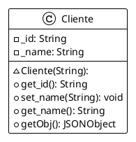

```plantuml
@startuml

!theme plain
top to bottom direction
skinparam linetype ortho

class Cliente {
  ~ Cliente(String): 
  - _id: String
  - _name: String
  + get_id(): String
  + set_name(String): void
  + get_name(): String
  + getObj(): JSONObject
}

@enduml
```