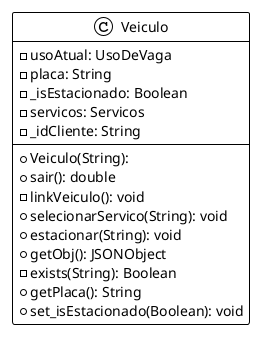

```plantuml
@startuml

!theme plain
top to bottom direction
skinparam linetype ortho

class Veiculo {
  + Veiculo(String): 
  - usoAtual: UsoDeVaga
  - placa: String
  - _isEstacionado: Boolean
  - servicos: Servicos
  - _idCliente: String
  + sair(): double
  - linkVeiculo(): void
  + selecionarServico(String): void
  + estacionar(String): void
  + getObj(): JSONObject
  - exists(String): Boolean
  + getPlaca(): String
  + set_isEstacionado(Boolean): void
}

@enduml
```